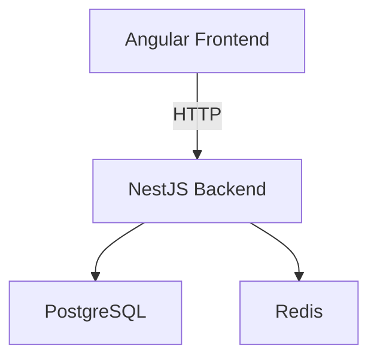

🚀 Gaynaako Claw

 <b>Modern Full-Stack Platform</b>  NestJS • Angular • PostgreSQL • Redis • Docker 
 
      

---

## ✨ Overview

Gaynaako Claw is a clean, scalable and production-ready full-stack architecture designed for:

- ⚡ Rapid MVP development  
- 🐳 Docker-first deployment  
- 🧱 Modular backend structure  
- 🎨 SPA frontend architecture  
- 🔐 Secure & extensible foundation  

## 🏗 Architecture

🚀 Quick Start

1️⃣ Clone
git clone https://github.com/your-username/gaynaako-claw.git
cd gaynaako-claw
2️⃣ Run everything
docker compose up --build
3️⃣ Access
Service	URL
🎨 Frontend	http://localhost:4200

🧠 Backend	http://localhost:3000

🐘 PostgreSQL	localhost:5432
⚡ Redis	localhost:6379
📁 Project Structure
gaynaako-claw/
│
├── backend/        # NestJS API
├── frontend/       # Angular SPA
├── docker-compose.yml
└── README.md
⚙️ Environment Setup

Create a .env file in /backend:

DB_HOST=postgres
DB_PORT=5432
DB_USERNAME=postgres
DB_PASSWORD=postgres
DB_NAME=gaynaako

REDIS_HOST=redis
REDIS_PORT=6379
🧠 Features

Modular NestJS architecture

Angular SPA

PostgreSQL relational database

Redis caching layer

Dockerized environment

Hot reload in development

📦 Production Ready

Run in background:

docker compose up -d

Recommended for production:

Nginx for Angular build

HTTPS (Let’s Encrypt)

CI/CD pipeline

Monitoring & logging

📈 Roadmap

 JWT Authentication

 Role-based access

 Swagger Documentation

 E2E Testing

 CI/CD

🤝 Contributing

Pull Requests are welcome.

📜 License

MIT

